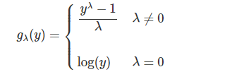

```{r setup, include=FALSE}
knitr::opts_chunk$set(echo = TRUE)

suppressWarnings(library(readxl))
suppressWarnings(library(MASS)) 
suppressWarnings(library(faraway))
suppressWarnings(library(stats)) 
suppressWarnings(library(psych)) 
suppressWarnings(library(olsrr)) 
suppressWarnings(library(reactable)) 
suppressWarnings(library(modelr))
suppressWarnings(library(broom))
suppressWarnings(library(ggpubr))
suppressWarnings(library(nortest))
suppressWarnings(library(ggplot2))
suppressWarnings(library(lmtest))
suppressWarnings(library(corrplot))
suppressWarnings(library(RColorBrewer))
suppressWarnings(library(car))
suppressWarnings(library(olsrr))
suppressWarnings(library(glmnet))
suppressWarnings(library(quantreg))


# Importar archivos


initech <- read_excel("C:/Users/oscar/Desktop/E. Medidas remediales/initech.xlsx")
autompg <- read_excel("C:/Users/oscar/Desktop/E. Medidas remediales/autompg.xlsx")
marketing <- read_excel("C:/Users/oscar/Desktop/E. Medidas remediales/marketing.xlsx")

```

# Algunas medidas remediales en  la RLM.

El presente laboratorio se centra en presentar algunas medidas remediales para una RLM.

Veremos algunas herramientas analíticas para "remediar" el uso de una regresión:

- Eliminar valores extremos
- La transformación de variables
- La Regresión de Ridge.
- La Regresión ponderada.
- La regresión Robusta.
- La regresión cuantílica. 


## Eliminación de los valores extremos. 

### Eliminar casos


Se pueden utilizar distintos métodos para elminar los casos en un archivo de datos: subset(), slice(), por índice, por nombre, etc...

```{r}
# create dataframe

df1 = data.frame(Name = c('George','Andrea', 'Micheal','Maggie','Ravi','Xien','Jalpa'), 

                 Grade_score=c(4,6,2,9,5,7,8),

                 Mathematics1_score=c(45,78,44,89,66,49,72),

                 Science_score=c(56,52,45,88,33,90,47))
 
df1

```

Con el subset()

```{r}
df2<-subset(df1, Name!="George" & Name!="Andrea")
df2

```


Con el slice()

```{r}
library(dplyr)
df2 <- df1 %>% slice(-c(2, 4, 6))
df2


```

Etc....

### Detectar los outliers


#### Por casos:

Vamos a crear o  insertamos un par de valores atípicos en la columna  disp del conjunto de datos mtcars
(mtcars viene con el paquete base, por lo que no es necesario importar nada... ). Para tener un par de valores atípicos en este conjunto de datos, simplemente multiplicamos los valores en mtcars $ disp que son superiores a 420 por * 2

```{r}
mtcars$disp[which(mtcars$disp >420)] <- c(mtcars$disp[which(mtcars$disp >420)]*2)

```

Vemos el bloxplot:

```{r}
boxplot(mtcars$disp)
```

Hay tres valores muy atípicos....


Veamos cuales son mediante la opción **$out**, y los vamos a guardar a parte en un vector *outliers*

```{r}
boxplot(mtcars$disp, plot=TRUE)$out

outliers <- boxplot(mtcars$disp, plot=FALSE)$out
print(outliers)
```

Estos valos los podemos ver así en el set de datos, utilizando la función *which* :

```{r}
mtcars[which(mtcars$disp %in% outliers),]
```

Para elimina los outliers, utilizamos lo anterior *mtcars[which(mtcars$disp %in% outliers),]* en el archivo de datos.


```{r}
mtcars <- mtcars[-which(mtcars$disp %in% outliers),]
```

El resultado luego de haber eliminado los outliers:

```{r}
boxplot(mtcars$disp)
```


### Verificar los valores extremos en la regresión.

Veamos el caso de Boston y sus posibles outliers.


```{r}
tail(Boston)

modelo_multiple <- lm(formula = medv ~ crim + indus+ age +  tax + black + lstat, data = Boston)


residuos <- summary(modelo_multiple)$residuals

boxplot(residuos)

```

Es evidente que hay valores extremos dado que, deben haber precios de las casas algo altos...

Se utilizamos el método anterior. Vamos a calcular los residuos, y vamos a "pegar" o crear la columna de residios en el archivo de Boston.

```{r}
library(dplyr)

residuos <- as.data.frame(residuos)
dim(residuos)
dim(Boston)

Boston <- bind_cols(Boston,residuos)
dim(Boston)
```

Veamos un momento los residuos:

```{r}
boxplot(Boston$residuos, plot=FALSE)$out

outliers <- boxplot(Boston$residuos, plot=FALSE)$out
print(outliers)


```


Podemos ver las líneas o los casos que resultaron valores extremos en el archivo de datos.

```{r}
Boston[which(Boston$residuos %in% outliers),]


Boston <-  Boston[-which(Boston$residuos %in% outliers),]


```

Veamos el resultado, una vez estos eliminados:

```{r}
boxplot(Boston$residuos)
```

Efecticamente, se eliminaron y tenemos menos presencia de estos en el archivo de Bostosn

¿Fue permitente su eliminación?

Para mi no... creo que era mejor aplicar una regresión robusta o cuantílica.


## Transformación de variables

Transforma la variable es pasar de una forma lineal, a una transformación logarítmica, exponencia, cuadrática, polinomila, etc....

Las transformaciones se pueden llevar a cabo tanto para la variable dependiente **Y**, como para las variables independientes **X**.

Veamos el caso de transformar la variable dependiente.

### Transformación en la variable dependiente Y

Veamos el caso del archivo de datos initech, el cual es un archivo de datos sobre salarios:

```{r}


plot(salary ~ years, data = initech, col = "grey", pch = 20, cex = 1.5,
     main = "Salaries at Initech, By Seniority")

hist(initech$salary)
boxplot(initech$salary)
```

Y pues si.... el salario tiene a ser una variable asimétrica positiva. 

Estimemos el modelo de regresión de todas formas

```{r}
initech_fit = lm(salary ~ years, data = initech)
summary(initech_fit)


plot(salary ~ years, data = initech, col = "grey", pch = 20, cex = 1.5,
     main = "Salaries at Initech, By Seniority")
abline(initech_fit, col = "darkorange", lwd = 2)
```

Pues el modelo, para los salarios, parece desviarce un poco de lo que se esperaría. 

Veamos un poco la elaluación de los diagnósticos.


```{r}
par(mfrow = c(1, 2))

plot(fitted(initech_fit), resid(initech_fit), col = "grey", pch = 20,
     xlab = "Fitted", ylab = "Residuals", main = "Fitted versus Residuals")
abline(h = 0, col = "darkorange", lwd = 2)

qqnorm(resid(initech_fit), main = "Normal Q-Q Plot", col = "darkgrey")
qqline(resid(initech_fit), col = "dodgerblue", lwd = 2)
```


Vemos que hay una desviación considerable.... podríamos decir que es por los valores extremos, pero la misma variable, en su naturalesa, posee valores extremos.

Tal ves convenga aplicar una transformación a los salarios (variable Y).

Estimemos una regresión con dichas modificaciones:

```{r}
initech_fit_log = lm(log(salary) ~ years, data = initech)

```


Veamos el módeo como tal y sus diagnósticos.

```{r}
plot(log(salary) ~ years, data = initech, col = "grey", pch = 20, cex = 1.5,
     main = "Salaries at Initech, By Seniority")
abline(initech_fit_log, col = "darkorange", lwd = 2)
```


```{r}
par(mfrow = c(1, 2))

plot(fitted(initech_fit_log), resid(initech_fit_log), col = "grey", pch = 20,
     xlab = "Fitted", ylab = "Residuals", main = "Fitted versus Residuals")
abline(h = 0, col = "darkorange", lwd = 2)

qqnorm(resid(initech_fit_log), main = "Normal Q-Q Plot", col = "darkgrey")
qqline(resid(initech_fit_log), col = "dodgerblue", lwd = 2)
```

```{r}
summary(initech_fit_log)
```

Tal vez para este ejemplo, la transformación no resultó ser la opción para lidiar con los valores extremos, pero era una opción a ser considerada.

### BoxCox

El método de Box-Cox considera una familia de transformaciones sobre variables de respuesta estrictamente positivas,

""

 R trazará un gráfico de Box-Cox para que nos ayude a seleccionar rápidamente un valor de λ.A menudo elegimos un valor "agradable" dentro del intervalo de confianza, en lugar del valor de λ que realmente maximiza la probabilidad.
 
 Creo que lo mejor sería utilizar el valor propiamente que el estadístico de Box-Cox sugiere.

Veamos el siguiente ejemplo


```{r}
savings_model = lm(sr ~ ., data = savings)

boxcox(savings_model, plotit = TRUE)
```
¿Qué deberíamos elegir, el valor de λ Box-Cox o el 1?

R traza automáticamente el log-verosimilitud en función de posibles Valores de λ. Indica tanto el valor que maximiza la probabilidad logarítmica como un intervalo de confianza para el valor de λ que maximiza la probabilidad logarítmica.

Podemos mejorar la visualización del λ.

```{r}
boxcox(savings_model, plotit = TRUE, lambda = seq(0.5, 1.5, by = 0.1))
```


Ahora veamos el set de datos Gala como ejemplo del uso del método Box-Cox para justificar una transformación distinta de log. Ajustamos un modelo de regresión múltiple aditiva con Especies como respuesta y la mayoría de las otras variables como predictores
 
```{r}
gala_model = lm(Species ~ Area + Elevation + Nearest + Scruz + Adjacent, data = gala)

plot(fitted(gala_model), resid(gala_model), col = "dodgerblue",
     pch = 20, cex = 1.5, xlab = "Fitted", ylab = "Residuals")
abline(h = 0, lty = 2, col = "darkorange", lwd = 2)
```

Aunque no hay muchos datos para valores ajustados grandes, todavía parece muy claro que se viola el supuesto de varianza constante.

Veamos si una posible transformación podría mejorar el ajuste. Para eso veamos si el método de BoxCox nos sugiere algo:

```{r}
boxcox(gala_model, lambda = seq(-0.25, 0.75, by = 0.05), plotit = TRUE)

```


```{r}
gala_model_cox = lm((((Species ^ 0.3) - 1) / 0.3) ~ Area + Elevation + Nearest + Scruz + Adjacent, data = gala)

plot(fitted(gala_model_cox), resid(gala_model_cox), col = "dodgerblue",
     pch = 20, cex = 1.5, xlab = "Fitted", ylab = "Residuals")
abline(h = 0, lty = 2, col = "darkorange", lwd = 2)

```
Vemos que si !!!!

Utilizamos la transformación de Cox, y tenemos un modelo que cumple con el supuesto.

### Transformación a los predictores.

Veamos algunas posibildiades, ante todo, el transformar los predictores en polinomios de grado 2 o grado 3.

Otra “transformación” muy común de una variable predictora es el uso de transformaciones polinomiales. Son extremadamente útiles ya que permiten modelos más flexibles, pero no cambian las unidades de las variables.

No debería sorprender que las ventas de un producto estén relacionadas con el presupuesto publicitario del producto, pero hay rendimientos decrecientes. Una empresa no siempre puede esperar rendimientos lineales basados en un mayor presupuesto publicitario.

Considere los datos mensuales de las ventas de widgets de Initech,
y,  en función del gasto publicitario de Initech para dicho widget,
X, ambos en diez mil dólares.


Veamos el gráfico o la visualización de la data:

```{r}

plot(sales ~ advert, data = marketing, 
     xlab = "Advert Spending (in $10,000)", ylab = "Sales (in $10,000)",
     pch = 20, cex = 2)

```
Realicemos una estimación lineal_

```{r}
mark_mod = lm(sales ~ advert, data = marketing)
summary(mark_mod)
```

¿Qué podemos concluir?


Realicemos una estimación de un Polinomio de grado 2

```{r}
mark_mod_poly2 = lm(sales ~ advert + I(advert ^ 2), data = marketing)
summary(mark_mod_poly2)
```

¿Qué podemos concluir?

Realicemos una estimación de un Polinomio de grado 3

```{r}
mark_mod_poly3 = lm(sales ~ advert + I(advert ^ 2) + I(advert ^ 3), data = marketing)
summary(mark_mod_poly3)
```

¿Qué podemos concluir?

Ahora vemos que con los términos de primer y segundo orden en el modelo, el término de tercer orden también es significativo. ¿Pero esto tiene sentido en la práctica? La siguiente trama debería dar pistas de por qué no es así. (¡El modelo con el término de tercer orden no tiene rendimientos decrecientes!). Por lo que se debe de tener cuidado con el uso de los polinomios !

Veamos la siguiente comparación de los distintos métodos:

```{r}
plot(sales ~ advert, data = marketing, 
     xlab = "Advert Spending (in $10,000)", ylab = "Sales (in $10,000)",
     pch = 20, cex = 2)
abline(mark_mod, lty = 2, col = "green", lwd = 2)
xplot = seq(0, 16, by = 0.01)
lines(xplot, predict(mark_mod_poly2, newdata = data.frame(advert = xplot)),
      col = "blue", lwd = 2)
lines(xplot, predict(mark_mod_poly3, newdata = data.frame(advert = xplot)),
      col = "red", lty = 3, lwd = 3)
```


## Regresión de Ridge

La regresión de crestas (o de Ridge) es un método que podemos utilizar para ajustar un modelo de regresión cuando la multicolinealidad está presente en los datos. En pocas palabras, la regresión de mínimos cuadrados intenta encontrar estimaciones de coeficientes que minimicen la suma de los residuos al cuadrado (RSS):

RSS = Σ (yi - ŷi) 2

dónde:

Σ: símbolo griego que significa suma
yi: el valor de respuesta real para la i-ésima observación
ŷi: el valor de respuesta predicho basado en el modelo de regresión lineal múltiple
Por el contrario, la regresión de crestas busca minimizar lo siguiente:

RSS + λΣβj2

donde j varía de 1 ap variables predictoras y λ ≥ 0.

Este segundo término de la ecuación se conoce como penalización por contracción. 

En la regresión de Ridge, seleccionamos un valor para λ que produce el MSE de prueba más bajo posible (error cuadrático medio), pero a cambio eliminamos el problema de la multicolinealidad en el modelo de regresión.


Para este ejemplo, usaremos el conjunto de datos integrado de R llamado mtcars. Usaremos hp como variable de respuesta y las siguientes variables como predictores:

mpg
peso
maldita sea
qsec
Para realizar la regresión de crestas, usaremos funciones del paquete glmnet. Este paquete requiere que la variable de respuesta sea un vector y que el conjunto de variables predictoras sea de la clase data.matrix.

El siguiente código muestra cómo definir nuestros datos:

```{r}
y <- mtcars$hp

x <- data.matrix(mtcars[, c('mpg', 'wt', 'drat', 'qsec')])
```

Estimemos un modelo de Ridge.

A continuación, usaremos la función glmnet () para ajustar el modelo de regresión de la cresta y especificaremos alpha = 0.

Tenga en cuenta que establecer alfa igual a 1 es equivalente a usar Regresión de lazo y establecer alfa en algún valor entre 0 y 1 es equivalente a usar una red elástica.

También tenga en cuenta que la regresión de crestas requiere que los datos estén estandarizados de manera que cada variable predictora tenga una media de 0 y una desviación estándar de 1.

Afortunadamente glmnet () realiza automáticamente esta estandarización por usted. Si ya estandarizó las variables, puede especificar estandarizar = Falso.


```{r}
library(glmnet)

model <- glmnet(x, y, alpha = 0)


summary(model)
```


Escoger el valor óptimo de Lambda


A continuación, identificaremos el valor lambda que produce el error cuadrático medio de prueba (MSE) más bajo mediante el uso de una validación cruzada de k veces.

Afortunadamente, glmnet tiene la función cv.glmnet () que realiza automáticamente una validación cruzada de k veces utilizando k = 10 veces.


```{r}
#perform k-fold cross-validation to find optimal lambda value
cv_model <- cv.glmnet(x, y, alpha = 0)

#find optimal lambda value that minimizes test MSE
best_lambda <- cv_model$lambda.min
best_lambda


#produce plot of test MSE by lambda value
plot(cv_model)
```


El valor lambda que minimiza la prueba MSE resulta ser 10.04567.

Analicemos el modelo final


Por último, podemos analizar el modelo final producido por el valor lambda óptimo.

Podemos usar el siguiente código para obtener las estimaciones de coeficientes para este modelo:


```{r}
#find coefficients of best model
best_model <- glmnet(x, y, alpha = 0, lambda = best_lambda)
coef(best_model)
```

También podemos producir un diagrama de seguimiento para visualizar cómo cambiaron las estimaciones de coeficientes como resultado del aumento de lambda

```{r}
#produce Ridge trace plot
plot(model, xvar = "lambda")
```


Por último, podemos calcular el R cuadrado del modelo en los datos:

```{r}
#use fitted best model to make predictions
y_predicted <- predict(model, s = best_lambda, newx = x)

#find SST and SSE
sst <- sum((y - mean(y))^2)
sse <- sum((y_predicted - y)^2)

#find R-Squared
rsq <- 1 - sse/sst
rsq


```


El R cuadrado resulta ser 0,7999513. Es decir, el mejor modelo fue capaz de explicar el 79,99% de la variación en los valores de respuesta de los datos de entrenamiento.


## Otras medidas: reggresión de menimos cuadrados ponderados - regresión robusta - regresión cuantílica 


### Regresión por mínimos cuadrados ponderados 

https://www.statology.org/weighted-least-squares-in-r/

Uno de los supuestos clave de la regresión lineal es que los residuos se distribuyen con la misma varianza en cada nivel de la variable predictora. Esta suposición se conoce como homocedasticidad.

Cuando se viola este supuesto, decimos que la heterocedasticidad está presente en los residuos. Cuando esto ocurre, los resultados de la regresión se vuelven poco fiables.

Una forma de manejar este problema es usar la regresión de mínimos cuadrados ponderados, que coloca ponderaciones en las observaciones de manera que aquellas con una pequeña varianza del error reciben más peso, ya que contienen más información en comparación con las observaciones con una mayor varianza del error.

Este tutorial proporciona un ejemplo paso a paso de cómo realizar una regresión de mínimos cuadrados ponderados en R.

Datos

```{r}
df <- data.frame(hours=c(1, 1, 2, 2, 2, 3, 4, 4, 4, 5, 5, 5, 6, 6, 7, 8),
                 score=c(48, 78, 72, 70, 66, 92, 93, 75, 75, 80, 95, 97, 90, 96, 99, 99))
```

Modelo de regresión

```{r}
#fit simple linear regression model
model <- lm(score ~ hours, data = df)

#view summary of model
summary(model)
```

Probando la heteroscedasticidad

```{r}
#create residual vs. fitted plot
plot(fitted(model), resid(model), xlab='Fitted Values', ylab='Residuals')

#add a horizontal line at 0 
abline(0,0)
```

Podemos ver en la gráfica que los residuos exhiben una forma de "cono", no están distribuidos con la misma varianza en toda la gráfica.

Para probar formalmente la heterocedasticidad, podemos realizar una prueba de Breusch-Pagan:


```{r}
#load lmtest package
library(lmtest)

#perform Breusch-Pagan test
bptest(model)
```

La prueba de Breusch-Pagan utiliza las siguientes hipótesis nulas y alternativas:

Hipótesis nula (H0): la homocedasticidad está presente (los residuos se distribuyen con la misma varianza)
Hipótesis alternativa (HA): hay heterocedasticidad (los residuos no se distribuyen con la misma varianza)


Dado que el valor p de la prueba es 0.0466, rechazaremos la hipótesis nula y concluiremos que la heterocedasticidad es un problema en este modelo.


Realizar regresión de mínimos cuadrados ponderados


Dado que la heterocedasticidad está presente, realizaremos mínimos cuadrados ponderados definiendo los pesos de tal manera que se dé más peso a las observaciones con menor varianza:

```{r}
#Definamos los pesos
wt <- 1 / lm(abs(model$residuals) ~ model$fitted.values)$fitted.values^2

#realizar regresión de mínimos cuadrados ponderados
wls_model <- lm(score ~ hours, data = df, weights=wt)

#view summary of model
summary(wls_model)
```

A partir de la salida, podemos ver que la estimación del coeficiente para la variable predictora horas cambió un poco y el ajuste general del modelo mejoró.

El modelo de mínimos cuadrados ponderados tiene un error estándar residual de 1,199 en comparación con 9,224 en el modelo de regresión lineal simple original.

Esto indica que los valores predichos producidos por el modelo de mínimos cuadrados ponderados están mucho más cerca de las observaciones reales en comparación con los valores predichos producidos por el modelo de regresión lineal simple.

El modelo de mínimos cuadrados ponderados también tiene un R-cuadrado de .6762 en comparación con .6296 en el modelo de regresión lineal simple original.

Esto indica que el modelo de mínimos cuadrados ponderados es capaz de explicar más la varianza en los puntajes de los exámenes en comparación con el modelo de regresión lineal simple.

Estas métricas indican que el modelo de mínimos cuadrados ponderados ofrece un mejor ajuste a los datos en comparación con el modelo de regresión lineal simple.


### Regresión robusta

https://www.statology.org/robust-regression-in-r/

La regresión robusta es un método que podemos usar como alternativa a la regresión por mínimos cuadrados ordinarios cuando hay valores atípicos u observaciones influyentes en el conjunto de datos con el que estamos trabajando.

Para realizar una regresión robusta en R, podemos usar la función rlm () del paquete MASS, que usa la siguiente sintaxis:

El siguiente ejemplo paso a paso muestra cómo realizar una regresión robusta en R para un conjunto de datos determinado.

Datos

Primero, creemos un conjunto de datos falso para trabajar:

```{r}
#create data
df <- data.frame(x1=c(1, 3, 3, 4, 4, 6, 6, 8, 9, 3,
                      11, 16, 16, 18, 19, 20, 23, 23, 24, 25),
                 x2=c(7, 7, 4, 29, 13, 34, 17, 19, 20, 12,
                      25, 26, 26, 26, 27, 29, 30, 31, 31, 32),
                  y=c(17, 170, 19, 194, 24, 2, 25, 29, 30, 32,
                      44, 60, 61, 63, 63, 64, 61, 67, 59, 70))

#view first six rows of data
head(df)
```

Realizar regresión de mínimos cuadrados ordinarios

A continuación, ajustemos un modelo de regresión de mínimos cuadrados ordinario y creemos una gráfica de los residuos estandarizados.

En la práctica, a menudo consideramos que cualquier residuo estandarizado con un valor absoluto superior a 3 es un valor atípico.

```{r}
#fit ordinary least squares regression model
ols <- lm(y~x1+x2, data=df)

#create plot of y-values vs. standardized residuals
plot(df$y, rstandard(ols), ylab='Standardized Residuals', xlab='y') 
abline(h=0)
```

En la gráfica podemos ver que hay dos observaciones con residuos estandarizados alrededor de 3.

Esta es una indicación de que hay dos posibles valores atípicos en el conjunto de datos y, por lo tanto, podemos beneficiarnos de realizar una regresión robusta.


Estimación de la regresión robusta

A continuación, usemos la función rlm () para ajustar un modelo de regresión robusto:

```{r}
library(MASS)

#fit robust regression model
robust <- rlm(y~x1+x2, data=df)

summary(robust)

names(robust)
```

Para determinar si este modelo de regresión robusto ofrece un mejor ajuste a los datos en comparación con el modelo OLS, podemos calcular el error estándar residual de cada modelo.

El error estándar residual (RSE) es una forma de medir la desviación estándar de los residuos en un modelo de regresión. Cuanto menor sea el valor de RSE, más fielmente podrá un modelo ajustarse a los datos.

El siguiente código muestra cómo calcular el RSE para cada modelo:

```{r}
#find residual standard error of ols model
summary(ols)$sigma

#find residual standard error of ols model
summary(robust)$sigma


```

Podemos ver que el RSE para el modelo de regresión robusto es mucho más bajo que el modelo de regresión de mínimos cuadrados ordinario, lo que nos dice que el modelo de regresión robusto ofrece un mejor ajuste a los datos.


### Regresión cuantílica

https://www.statology.org/quantile-regression-in-r/

La regresión lineal es un método que podemos utilizar para comprender la relación entre una o más variables predictoras y una variable de respuesta.

Normalmente, cuando realizamos una regresión lineal, nos interesa estimar el valor medio de la variable de respuesta.

Sin embargo, podríamos utilizar en su lugar un método conocido como regresión cuantílica para estimar cualquier valor cuantílico o percentil del valor de respuesta, como el percentil 70, el percentil 90, el percentil 98, etc.

Para realizar la regresión de cuantiles en R podemos usar la función rq () del paquete quantreg, que usa la siguiente sintaxis:

**library(quantreg)**

**model <- rq(y ~ x, data = dataset, tau = 0.5)**

En donde:

y: la variable de respuesta
x: la (s) variable (s) predictoras
datos: el nombre del conjunto de datos
tau: El percentil a encontrar. El valor predeterminado es la mediana (tau = 0.5) pero puede ver esto en cualquier número entre 0 y 1.
Este tutorial proporciona un ejemplo paso a paso de cómo utilizar esta función para realizar una regresión de cuantiles en R.


Datos 


Para este ejemplo, crearemos un conjunto de datos que contiene las horas estudiadas y el puntaje del examen recibido por 100 estudiantes diferentes en alguna universidad:

```{r}
#make this example reproducible
set.seed(0)

#create data frame 
hours <- runif(100, 1, 10)
score <- 60 + 2*hours + rnorm(100, mean=0, sd=.45*hours)
df <- data.frame(hours, score)

#view first six rows
head(df)
```


Aplicando la regresión cuantílica 

A continuación, ajustaremos un modelo de regresión por cuantiles utilizando las horas estudiadas como variable predictiva y la puntuación del examen como variable de respuesta.

Usaremos el modelo para predecir el percentil 90 esperado de los puntajes de los exámenes según la cantidad de horas estudiadas:


```{r}
library(quantreg)

#fit model
model <- rq(score ~ hours, data = df, tau = 0.7)

#view summary of model
summary(model)
```


Veamos de forma visual los resultados:

```{r}
library(ggplot2)

#create scatterplot with quantile regression line
ggplot(df, aes(hours,score)) +
  geom_point() + 
  geom_abline(intercept=coef(model)[1], slope=coef(model)[2])
```


A diferencia de una línea de regresión lineal tradicional, observe que esta línea ajustada no atraviesa el corazón de los datos. En cambio, pasa por el percentil 90 estimado en cada nivel de la variable predictora.

Podemos ver la diferencia entre la ecuación de regresión cuantílica ajustada y la ecuación de regresión lineal simple agregando el argumento geom_smooth ():


```{r}
library(ggplot2)

#create scatterplot with quantile regression line and simple linear regression line
ggplot(df, aes(hours,score)) +
  geom_point() + 
  geom_abline(intercept=coef(model)[1], slope=coef(model)[2]) +
  geom_smooth(method="lm", se=F)
```

La línea negra muestra la línea de regresión de cuantiles ajustados para el percentil 90 y la línea azul muestra la línea de regresión lineal simple, que estima el valor medio de la variable de respuesta.

Como era de esperar, la línea de regresión lineal simple atraviesa los datos y nos muestra el valor medio estimado de las puntuaciones de los exámenes en cada nivel de horas.

